# Design Document: AWS Anomaly Detection

## Overview

The AWS Anomaly Detection system extends the CivicBio Flask application with serverless statistical analysis capabilities. The architecture follows a modular design where waste creation remains the primary operation, with anomaly detection operating as a non-blocking enhancement.

The system uses AWS Lambda for compute, CloudWatch for audit logging, and optionally S3 for report archival. All components integrate with the existing Flask/MongoDB stack using boto3, maintaining the role-based access control model and IST timezone conventions.

### Design Principles

1. **Non-blocking**: Anomaly detection failures must never prevent waste entry creation
2. **Lightweight**: Use Python standard library (statistics module) instead of heavy ML frameworks
3. **Modular**: Lambda function operates independently from Flask application
4. **Explainable**: Z-score methodology provides transparent, interpretable results
5. **Scalable**: Serverless architecture handles variable load automatically

## Architecture

### AWS Architecture Diagram

```mermaid
graph TB
    subgraph "User Layer"
        FU[👤 Facility User]
        CU[👤 Civic User]
    end
    
    subgraph "Flask Application Layer"
        API[🌐 Flask API<br/>Python/MongoEngine]
        WR[📝 Waste Routes<br/>/api/waste]
        CR[📊 Civic Routes<br/>/api/civic/dashboard]
        AS[⚙️ Anomaly Service<br/>boto3 integration]
    end
    
    subgraph "AWS Cloud - ap-south-1"
        LF[⚡ Lambda Function<br/>civicbio-anomaly-detector<br/>Python 3.11]
        CW[📋 CloudWatch Logs<br/>Audit Trail]
        S3[🗄️ S3 Bucket<br/>civicbio-anomaly-reports<br/>Optional]
    end
    
    subgraph "Database Layer"
        MDB[(🍃 MongoDB<br/>Collections:<br/>- waste<br/>- users<br/>- waste_anomalies)]
    end
    
    FU -->|POST /api/waste| WR
    CU -->|GET /api/civic/dashboard| CR
    
    WR -->|1. Save waste entry| MDB
    WR -->|2. Query last 30 days| MDB
    WR -->|3. Invoke Lambda<br/>timeout=5s| AS
    
    AS -->|boto3.invoke<br/>RequestResponse| LF
    
    LF -->|Calculate Z-score<br/>statistics module| LF
    LF -->|Log analysis| CW
    LF -->|Return result| AS
    
    AS -->|4. Save if anomaly| MDB
    AS -->|Optional: Upload report| S3
    
    CR -->|Query anomalies| MDB
    CR -->|Return dashboard| CU
    
    WR -->|Return success| FU
    
    style LF fill:#FF9900
    style CW fill:#FF9900
    style S3 fill:#FF9900
    style MDB fill:#13AA52
    style API fill:#3776AB
    style FU fill:#4A90E2
    style CU fill:#4A90E2
```



### System Components

```
┌─────────────────────────────────────────────────────────────┐
│                     Flask Application                        │
│  ┌────────────────────────────────────────────────────────┐ │
│  │  Waste Creation Endpoint                               │ │
│  │  1. Save Waste_Entry to MongoDB                        │ │
│  │  2. Query last 30 days quantities                      │ │
│  │  3. Invoke Lambda (async, timeout=5s)                  │ │
│  │  4. Parse response & save WasteAnomaly if flagged      │ │
│  └────────────────────────────────────────────────────────┘ │
│                                                               │
│  ┌────────────────────────────────────────────────────────┐ │
│  │  Civic Dashboard Endpoint                              │ │
│  │  1. Check role="civic"                                 │ │
│  │  2. Query today's anomaly count (IST)                  │ │
│  │  3. Query recent 10 anomalies                          │ │
│  │  4. Highlight high-risk facilities                     │ │
│  └────────────────────────────────────────────────────────┘ │
└─────────────────────────────────────────────────────────────┘
                            │
                            │ boto3.invoke()
                            ▼
┌─────────────────────────────────────────────────────────────┐
│                    AWS Lambda Function                       │
│  ┌────────────────────────────────────────────────────────┐ │
│  │  Anomaly_Detector                                      │ │
│  │  Input: {facility_id, current_quantity,               │ │
│  │          historical_quantities}                        │ │
│  │                                                        │ │
│  │  Logic:                                                │ │
│  │  - Validate input (>=5 entries, std>0)                │ │
│  │  - Calculate mean, std_dev                            │ │
│  │  - Compute z_score = (current - mean) / std           │ │
│  │  - Flag if |z_score| >= 2.5                           │ │
│  │  - Log to CloudWatch                                  │ │
│  │                                                        │ │
│  │  Output: {is_anomaly, z_score, mean, std_dev}        │ │
│  └────────────────────────────────────────────────────────┘ │
└─────────────────────────────────────────────────────────────┘
                            │
                            │ logs
                            ▼
                    ┌──────────────┐
                    │  CloudWatch  │
                    └──────────────┘

┌─────────────────────────────────────────────────────────────┐
│                      MongoDB Collections                     │
│  ┌──────────────┐  ┌──────────────┐  ┌──────────────────┐  │
│  │    Waste     │  │     User     │  │  WasteAnomaly    │  │
│  │              │  │              │  │                  │  │
│  │ - category   │  │ - role       │  │ - facility_id    │  │
│  │ - quantity   │  │ - details    │  │ - waste_id       │  │
│  │ - facility_id│  │              │  │ - actual_qty     │  │
│  │ - status     │  │              │  │ - mean           │  │
│  │ - created_at │  │              │  │ - std_dev        │  │
│  │              │  │              │  │ - z_score        │  │
│  │              │  │              │  │ - flagged        │  │
│  │              │  │              │  │ - created_at     │  │
│  └──────────────┘  └──────────────┘  └──────────────────┘  │
└─────────────────────────────────────────────────────────────┘

Optional:
┌─────────────────────────────────────────────────────────────┐
│                          AWS S3                              │
│  Bucket: civicbio-anomaly-reports                           │
│  Objects: {facility_id}/{timestamp}.json                    │
└─────────────────────────────────────────────────────────────┘
```

### Data Flow

1. **Waste Creation Flow**:
   - Facility user submits waste entry via Flask API
   - Flask validates and saves Waste_Entry to MongoDB
   - Flask queries last 30 days of quantities for that facility
   - Flask invokes Lambda with facility_id, current_quantity, historical_quantities
   - Lambda calculates statistics and returns anomaly verdict
   - If anomaly detected, Flask creates WasteAnomaly_Record
   - Flask returns success to user (regardless of Lambda outcome)

2. **Dashboard Query Flow**:
   - Civic user requests dashboard
   - Flask verifies role="civic"
   - Flask queries WasteAnomaly collection for today's count (IST)
   - Flask queries WasteAnomaly collection for recent 10 records
   - Flask identifies facilities with multiple recent anomalies
   - Flask returns dashboard data with KPIs and alerts

## Components and Interfaces

### 1. AWS Lambda Function: Anomaly_Detector

**Runtime**: Python 3.11

**Handler**: `lambda_function.lambda_handler`

**Input Schema**:
```python
{
    "facility_id": str,           # MongoDB ObjectId as string
    "current_quantity": float,    # Current waste quantity in kg
    "historical_quantities": [float]  # List of past 30 days quantities
}
```

**Output Schema**:
```python
{
    "facility_id": str,
    "is_anomaly": bool,
    "z_score": float,
    "mean": float,
    "std_dev": float
}
```

**Error Response**:
```python
{
    "error": str,
    "message": str
}
```

**Implementation**:
```python
import json
import logging
from statistics import mean, stdev
from datetime import datetime

logger = logging.getLogger()
logger.setLevel(logging.INFO)

ANOMALY_THRESHOLD = 2.5
MIN_HISTORICAL_COUNT = 5

def lambda_handler(event, context):
    """
    Detects anomalies in waste generation using Z-score analysis.
    """
    try:
        # Parse input
        facility_id = event.get('facility_id')
        current_quantity = event.get('current_quantity')
        historical_quantities = event.get('historical_quantities', [])
        
        # Validate input
        if not facility_id or current_quantity is None:
            return {
                'statusCode': 400,
                'body': json.dumps({'error': 'Missing required fields'})
            }
        
        # Edge case: insufficient historical data
        if len(historical_quantities) < MIN_HISTORICAL_COUNT:
            logger.info(f"Insufficient data for {facility_id}: {len(historical_quantities)} entries")
            return {
                'statusCode': 200,
                'body': json.dumps({
                    'facility_id': facility_id,
                    'is_anomaly': False,
                    'z_score': 0.0,
                    'mean': 0.0,
                    'std_dev': 0.0
                })
            }
        
        # Calculate statistics
        hist_mean = mean(historical_quantities)
        hist_std = stdev(historical_quantities)
        
        # Edge case: zero standard deviation
        if hist_std == 0:
            logger.info(f"Zero std dev for {facility_id}")
            return {
                'statusCode': 200,
                'body': json.dumps({
                    'facility_id': facility_id,
                    'is_anomaly': False,
                    'z_score': 0.0,
                    'mean': hist_mean,
                    'std_dev': 0.0
                })
            }
        
        # Calculate Z-score
        z_score = (current_quantity - hist_mean) / hist_std
        is_anomaly = abs(z_score) >= ANOMALY_THRESHOLD
        
        # Log to CloudWatch
        logger.info(json.dumps({
            'facility_id': facility_id,
            'current_quantity': current_quantity,
            'z_score': z_score,
            'anomaly_detected': is_anomaly,
            'timestamp': datetime.utcnow().isoformat()
        }))
        
        return {
            'statusCode': 200,
            'body': json.dumps({
                'facility_id': facility_id,
                'is_anomaly': is_anomaly,
                'z_score': round(z_score, 3),
                'mean': round(hist_mean, 2),
                'std_dev': round(hist_std, 2)
            })
        }
        
    except Exception as e:
        logger.error(f"Error processing anomaly detection: {str(e)}")
        return {
            'statusCode': 500,
            'body': json.dumps({'error': 'Internal processing error'})
        }
```

### 2. Flask Integration Module

**File**: `app/services/anomaly_service.py`

**Interface**:
```python
class AnomalyDetectionService:
    """
    Service for integrating AWS Lambda anomaly detection with Flask.
    """
    
    def __init__(self, lambda_client, lambda_function_name: str):
        """
        Initialize with boto3 Lambda client and function name.
        """
        self.lambda_client = lambda_client
        self.lambda_function_name = lambda_function_name
        self.timeout = 5  # seconds
    
    def check_anomaly(self, facility_id: str, current_quantity: float, 
                     historical_quantities: list) -> dict:
        """
        Invoke Lambda function to check for anomaly.
        
        Returns:
            dict with keys: is_anomaly, z_score, mean, std_dev
            or None if invocation fails
        """
        pass
    
    def get_historical_quantities(self, facility_id: str, days: int = 30) -> list:
        """
        Query MongoDB for last N days of waste quantities for a facility.
        
        Returns:
            list of float quantities
        """
        pass
    
    def save_anomaly_record(self, facility_id: str, waste_id: str, 
                           anomaly_data: dict) -> bool:
        """
        Save WasteAnomaly record to MongoDB.
        
        Returns:
            True if saved successfully, False otherwise
        """
        pass
```

**Implementation**:
```python
import json
import logging
from datetime import datetime, timedelta
from bson import ObjectId
import pytz

logger = logging.getLogger(__name__)
IST = pytz.timezone('Asia/Kolkata')

class AnomalyDetectionService:
    
    def __init__(self, lambda_client, lambda_function_name: str):
        self.lambda_client = lambda_client
        self.lambda_function_name = lambda_function_name
        self.timeout = 5
    
    def check_anomaly(self, facility_id: str, current_quantity: float, 
                     historical_quantities: list) -> dict:
        """
        Invoke Lambda with timeout and error handling.
        """
        try:
            payload = {
                'facility_id': facility_id,
                'current_quantity': current_quantity,
                'historical_quantities': historical_quantities
            }
            
            response = self.lambda_client.invoke(
                FunctionName=self.lambda_function_name,
                InvocationType='RequestResponse',
                Payload=json.dumps(payload)
            )
            
            response_payload = json.loads(response['Payload'].read())
            
            if response_payload.get('statusCode') == 200:
                body = json.loads(response_payload['body'])
                return body
            else:
                logger.error(f"Lambda returned error: {response_payload}")
                return None
                
        except Exception as e:
            logger.error(f"Failed to invoke Lambda: {str(e)}")
            return None
    
    def get_historical_quantities(self, facility_id: str, days: int = 30) -> list:
        """
        Query last N days of waste quantities.
        """
        from app.models import Waste
        
        cutoff_date = datetime.now(IST) - timedelta(days=days)
        
        waste_entries = Waste.objects(
            facility_id=facility_id,
            created_at__gte=cutoff_date
        ).order_by('-created_at')
        
        quantities = [float(entry.quantity) for entry in waste_entries]
        return quantities
    
    def save_anomaly_record(self, facility_id: str, waste_id: str, 
                           anomaly_data: dict) -> bool:
        """
        Create WasteAnomaly record in MongoDB.
        """
        from app.models import WasteAnomaly
        
        try:
            anomaly = WasteAnomaly(
                facility_id=facility_id,
                waste_id=waste_id,
                actual_quantity=anomaly_data.get('current_quantity'),
                mean=anomaly_data.get('mean'),
                std_dev=anomaly_data.get('std_dev'),
                z_score=anomaly_data.get('z_score'),
                flagged=True,
                created_at=datetime.now(IST)
            )
            anomaly.save()
            return True
        except Exception as e:
            logger.error(f"Failed to save anomaly record: {str(e)}")
            return False
```

### 3. Flask Route Integration

**File**: `app/routes/waste_routes.py`

**Endpoint**: `POST /api/waste`

**Modified Implementation**:
```python
from flask import Blueprint, request, jsonify
from app.models import Waste
from app.services.anomaly_service import AnomalyDetectionService
import boto3

waste_bp = Blueprint('waste', __name__)

# Initialize Lambda client
lambda_client = boto3.client('lambda', region_name='ap-south-1')
anomaly_service = AnomalyDetectionService(
    lambda_client=lambda_client,
    lambda_function_name='civicbio-anomaly-detector'
)

@waste_bp.route('/api/waste', methods=['POST'])
def create_waste():
    """
    Create waste entry with anomaly detection.
    """
    try:
        data = request.get_json()
        
        # Create and save waste entry (primary operation)
        waste = Waste(
            category=data['category'],
            quantity=data['quantity'],
            facility_id=data['facility_id'],
            status='pending',
            created_at=datetime.now(IST)
        )
        waste.save()
        
        # Anomaly detection (non-blocking enhancement)
        try:
            historical_quantities = anomaly_service.get_historical_quantities(
                facility_id=data['facility_id']
            )
            
            anomaly_result = anomaly_service.check_anomaly(
                facility_id=data['facility_id'],
                current_quantity=float(data['quantity']),
                historical_quantities=historical_quantities
            )
            
            if anomaly_result and anomaly_result.get('is_anomaly'):
                anomaly_service.save_anomaly_record(
                    facility_id=data['facility_id'],
                    waste_id=str(waste.id),
                    anomaly_data={
                        'current_quantity': float(data['quantity']),
                        'mean': anomaly_result['mean'],
                        'std_dev': anomaly_result['std_dev'],
                        'z_score': anomaly_result['z_score']
                    }
                )
        except Exception as e:
            # Log but don't fail the request
            logger.error(f"Anomaly detection failed: {str(e)}")
        
        return jsonify({
            'success': True,
            'waste_id': str(waste.id)
        }), 201
        
    except Exception as e:
        return jsonify({'error': str(e)}), 400
```

### 4. Civic Dashboard Route

**File**: `app/routes/civic_routes.py`

**Endpoint**: `GET /api/civic/dashboard`

**Implementation**:
```python
from flask import Blueprint, jsonify
from flask_login import login_required, current_user
from app.models import WasteAnomaly
from datetime import datetime
import pytz

civic_bp = Blueprint('civic', __name__)
IST = pytz.timezone('Asia/Kolkata')

@civic_bp.route('/api/civic/dashboard', methods=['GET'])
@login_required
def get_dashboard():
    """
    Get civic dashboard with anomaly KPIs.
    """
    # Check authorization
    if current_user.role != 'civic':
        return jsonify({'error': 'Unauthorized'}), 403
    
    # Get today's date in IST
    now_ist = datetime.now(IST)
    today_start = now_ist.replace(hour=0, minute=0, second=0, microsecond=0)
    today_end = now_ist.replace(hour=23, minute=59, second=59, microsecond=999999)
    
    # Count today's anomalies
    today_count = WasteAnomaly.objects(
        created_at__gte=today_start,
        created_at__lte=today_end
    ).count()
    
    # Get recent 10 anomalies
    recent_anomalies = WasteAnomaly.objects().order_by('-created_at').limit(10)
    
    # Identify high-risk facilities (multiple anomalies in last 7 days)
    seven_days_ago = now_ist - timedelta(days=7)
    from collections import Counter
    recent_facility_counts = Counter()
    
    for anomaly in WasteAnomaly.objects(created_at__gte=seven_days_ago):
        recent_facility_counts[anomaly.facility_id] += 1
    
    high_risk_facilities = [
        facility_id for facility_id, count in recent_facility_counts.items()
        if count >= 3
    ]
    
    return jsonify({
        'anomalies_today': today_count,
        'recent_anomalies': [
            {
                'facility_id': str(a.facility_id),
                'actual_quantity': a.actual_quantity,
                'z_score': a.z_score,
                'created_at': a.created_at.isoformat()
            }
            for a in recent_anomalies
        ],
        'high_risk_facilities': [str(f) for f in high_risk_facilities]
    }), 200
```

## Data Models

### WasteAnomaly (MongoEngine Document)

**File**: `app/models/waste_anomaly.py`

```python
from mongoengine import Document, StringField, FloatField, BooleanField, DateTimeField, ReferenceField
from datetime import datetime
import pytz

IST = pytz.timezone('Asia/Kolkata')

class WasteAnomaly(Document):
    """
    Stores detected waste generation anomalies.
    """
    meta = {
        'collection': 'waste_anomalies',
        'indexes': [
            'facility_id',
            'created_at',
            '-created_at',  # For recent queries
            'flagged'
        ]
    }
    
    facility_id = StringField(required=True)
    waste_id = StringField(required=True)
    actual_quantity = FloatField(required=True)
    mean = FloatField(required=True)
    std_dev = FloatField(required=True)
    z_score = FloatField(required=True)
    flagged = BooleanField(default=True)
    created_at = DateTimeField(default=lambda: datetime.now(IST))
    
    def __repr__(self):
        return f"<WasteAnomaly {self.facility_id} z={self.z_score}>"
```

### Existing Models (Reference)

**Waste Model** (already exists):
```python
class Waste(Document):
    category = StringField(required=True)
    quantity = FloatField(required=True)
    facility_id = StringField(required=True)
    status = StringField(default='pending')
    created_at = DateTimeField(default=lambda: datetime.now(IST))
```

**User Model** (already exists):
```python
class User(Document):
    role = StringField(required=True)  # 'facility', 'collector', 'disposal', 'civic'
    details = DictField()
```


## Correctness Properties

*A property is a characteristic or behavior that should hold true across all valid executions of a system—essentially, a formal statement about what the system should do. Properties serve as the bridge between human-readable specifications and machine-verifiable correctness guarantees.*

### Lambda Function Properties

**Property 1: Mean calculation correctness**

*For any* list of historical quantities with at least 5 numeric values, the calculated mean should equal the sum of values divided by the count of values.

**Validates: Requirements 1.1**

**Property 2: Standard deviation calculation correctness**

*For any* list of historical quantities with at least 5 numeric values, the calculated standard deviation should match the Python statistics.stdev() result.

**Validates: Requirements 1.2**

**Property 3: Z-score formula correctness**

*For any* current quantity, mean, and non-zero standard deviation, the calculated Z-score should equal (current_quantity - mean) / std_dev.

**Validates: Requirements 1.3**

**Property 4: Anomaly threshold detection**

*For any* calculated Z-score, the anomaly flag should be true if and only if the absolute value of the Z-score is greater than or equal to 2.5.

**Validates: Requirements 1.4, 1.5**

**Property 5: Output structure completeness**

*For any* valid Lambda invocation, the response should contain all required fields: is_anomaly (boolean), z_score (float), mean (float), std_dev (float), and facility_id (string).

**Validates: Requirements 1.6, 3.6**

**Property 6: Invalid input error handling**

*For any* Lambda invocation with missing or invalid required fields (facility_id or current_quantity), the function should return an error response with a descriptive message.

**Validates: Requirements 2.3**

**Property 7: Non-numeric value filtering**

*For any* historical_quantities list containing non-numeric values, the Lambda function should filter them out before performing statistical calculations.

**Validates: Requirements 2.4**

**Property 8: CloudWatch logging completeness**

*For any* completed anomaly analysis, the CloudWatch log entry should contain facility_id, current_quantity, z_score, anomaly_detected (boolean), and timestamp in ISO 8601 format.

**Validates: Requirements 4.1, 4.2, 4.3, 4.4, 4.5**

### Flask Integration Properties

**Property 9: Waste entry persistence before detection**

*For any* waste creation request, the Waste_Entry should be saved to MongoDB and retrievable before the Lambda function is invoked.

**Validates: Requirements 5.1**

**Property 10: Historical data retrieval correctness**

*For any* facility_id and 30-day window, the retrieved historical quantities should include only waste entries for that facility created within the last 30 days (calculated in IST timezone), sorted by created_at in descending order, with only quantity values extracted.

**Validates: Requirements 5.2, 9.1, 9.2, 9.3, 9.4**

**Property 11: Lambda invocation with correct parameters**

*For any* waste creation with historical data available, the Lambda invocation payload should contain the correct facility_id, current_quantity, and historical_quantities list.

**Validates: Requirements 5.3**

**Property 12: Response parsing correctness**

*For any* valid Lambda response, the Flask application should successfully parse the JSON and extract is_anomaly, z_score, mean, and std_dev values.

**Validates: Requirements 5.4**

**Property 13: Conditional anomaly record creation**

*For any* Lambda response, a WasteAnomaly_Record should be created in MongoDB if and only if is_anomaly is true.

**Validates: Requirements 5.5**

**Property 14: Error resilience for waste creation**

*For any* waste creation request, if the Lambda invocation fails, times out, or returns an error, the Waste_Entry should still be successfully created and a success response returned to the user.

**Validates: Requirements 5.6, 8.1, 8.2, 8.3, 8.4, 8.5**

**Property 15: WasteAnomaly record structure completeness**

*For any* created WasteAnomaly_Record, it should contain all required fields: facility_id, waste_id, actual_quantity, mean, std_dev, z_score, flagged (default true), and created_at (in IST timezone).

**Validates: Requirements 6.1, 6.2, 6.3, 6.4, 6.5, 6.6, 6.7, 6.8**

### Dashboard Properties

**Property 16: Today's anomaly count accuracy**

*For any* civic dashboard request, the "anomalies detected today" count should equal the number of WasteAnomaly_Records with created_at timestamps between today's start (00:00:00 IST) and end (23:59:59 IST).

**Validates: Requirements 7.1, 7.2, 12.3**

**Property 17: Recent anomalies retrieval**

*For any* civic dashboard request, the recent anomalies list should contain the 10 most recent WasteAnomaly_Records ordered by created_at descending, with each record showing facility_id, actual_quantity, z_score, and created_at.

**Validates: Requirements 7.3, 7.4**

**Property 18: High-risk facility identification**

*For any* civic dashboard request, a facility should be flagged as high-risk if and only if it has 3 or more WasteAnomaly_Records in the last 7 days (calculated in IST timezone).

**Validates: Requirements 7.5**

**Property 19: Role-based authorization**

*For any* anomaly dashboard request, access should be granted if and only if the authenticated user has role equal to "civic", otherwise an authorization error should be returned.

**Validates: Requirements 11.1, 11.2**

**Property 20: Facility data privacy**

*For any* facility user viewing their own waste entries, the response should not include anomaly flags, Z-scores, or any WasteAnomaly_Record data.

**Validates: Requirements 11.3**

**Property 21: Civic cross-facility visibility**

*For any* civic user querying anomaly data, the response should include WasteAnomaly_Records from all facilities without filtering by facility_id.

**Validates: Requirements 11.4**

### Timezone Properties

**Property 22: IST timestamp consistency**

*For any* WasteAnomaly_Record creation, the created_at field should be set to the current time in Asia/Kolkata timezone, and when displayed to users, should be formatted in IST.

**Validates: Requirements 12.1, 12.2**

**Property 23: IST date range calculations**

*For any* historical data query for the last 30 days, the cutoff date should be calculated using the current date/time in Asia/Kolkata timezone minus 30 days.

**Validates: Requirements 12.4**

### Optional S3 Properties

**Property 24: S3 report generation and upload**

*For any* detected anomaly when S3 integration is enabled, a JSON report containing anomaly details should be generated and uploaded to the designated S3 bucket, with the S3 object key stored in the WasteAnomaly_Record.

**Validates: Requirements 10.1, 10.2, 10.3**

**Property 25: S3 download link provision**

*For any* civic user viewing an anomaly with an associated S3 object key, the response should include a valid download link to the S3 report.

**Validates: Requirements 10.4**

**Property 26: S3 error resilience**

*For any* anomaly detection when S3 integration is enabled, if S3 upload fails, the error should be logged but the WasteAnomaly_Record should still be created successfully.

**Validates: Requirements 10.5**

## Error Handling

### Lambda Function Error Handling

1. **Insufficient Historical Data**: Return is_anomaly=false when fewer than 5 historical entries exist
2. **Zero Standard Deviation**: Return is_anomaly=false when all historical values are identical
3. **Invalid Input**: Return 400 error with descriptive message for missing required fields
4. **Processing Exceptions**: Catch all exceptions, log to CloudWatch, return 500 error

### Flask Application Error Handling

1. **Lambda Invocation Failures**:
   - Connection errors: Log and continue
   - Timeout (5 seconds): Log and continue
   - Malformed responses: Log and continue
   - Error status codes: Log and continue
   - **Critical**: Never block waste entry creation

2. **Database Errors**:
   - Waste save failure: Return 400 error to user
   - Anomaly save failure: Log error but don't fail request
   - Query failures: Log error and return empty results

3. **Authorization Errors**:
   - Non-civic users accessing dashboard: Return 403 Forbidden
   - Unauthenticated requests: Return 401 Unauthorized

4. **S3 Errors (Optional)**:
   - Upload failures: Log error but continue
   - Report generation failures: Log error but continue

### Error Logging Strategy

All errors should be logged with:
- Timestamp (ISO 8601)
- Error type/category
- Facility ID (if available)
- Stack trace (for exceptions)
- Request context

## Testing Strategy

### Dual Testing Approach

The testing strategy employs both unit tests and property-based tests as complementary approaches:

- **Unit tests**: Verify specific examples, edge cases, and error conditions
- **Property tests**: Verify universal properties across all inputs
- Together they provide comprehensive coverage: unit tests catch concrete bugs, property tests verify general correctness

### Property-Based Testing Configuration

**Library**: Use `hypothesis` for Python property-based testing

**Configuration**:
- Minimum 100 iterations per property test
- Each test must reference its design document property
- Tag format: `# Feature: aws-anomaly-detection, Property {number}: {property_text}`

**Example Property Test**:
```python
from hypothesis import given, strategies as st
import statistics

# Feature: aws-anomaly-detection, Property 1: Mean calculation correctness
@given(st.lists(st.floats(min_value=0, max_value=10000), min_size=5, max_size=100))
def test_mean_calculation_correctness(historical_quantities):
    """
    For any list of historical quantities with at least 5 numeric values,
    the calculated mean should equal the sum of values divided by count.
    """
    # Invoke Lambda
    result = invoke_lambda({
        'facility_id': 'test_facility',
        'current_quantity': 100.0,
        'historical_quantities': historical_quantities
    })
    
    # Verify mean calculation
    expected_mean = statistics.mean(historical_quantities)
    assert abs(result['mean'] - expected_mean) < 0.01
```

### Unit Testing Focus Areas

1. **Edge Cases**:
   - Zero standard deviation (all identical values)
   - Fewer than 5 historical entries
   - Empty historical data
   - Non-numeric values in historical data

2. **Specific Examples**:
   - Known anomaly case (Z-score = 3.0)
   - Known normal case (Z-score = 1.0)
   - Boundary case (Z-score = 2.5 exactly)

3. **Integration Points**:
   - Flask to Lambda communication
   - MongoDB save operations
   - CloudWatch logging
   - S3 upload (if enabled)

4. **Error Conditions**:
   - Lambda timeout simulation
   - Malformed JSON responses
   - Database connection failures
   - Authorization failures

### Test Data Generation

**For Property Tests**:
- Use hypothesis strategies to generate:
  - Random facility IDs
  - Random quantities (0-10000 kg)
  - Random historical data lists (5-100 entries)
  - Random timestamps within date ranges

**For Unit Tests**:
- Use fixtures for:
  - Known anomaly scenarios
  - Edge case data
  - Error simulation data

### Testing Priorities

1. **Critical Path** (must test):
   - Waste entry creation succeeds regardless of Lambda status
   - Z-score calculation correctness
   - Anomaly threshold detection
   - Role-based authorization

2. **High Priority**:
   - Historical data retrieval
   - Error resilience
   - Timezone consistency
   - CloudWatch logging

3. **Medium Priority**:
   - Dashboard KPIs
   - High-risk facility identification
   - Data model completeness

4. **Low Priority** (optional feature):
   - S3 integration
   - Report generation

### Mocking Strategy

**Mock AWS Services**:
- Use `moto` library for mocking boto3 Lambda and S3 clients
- Use `freezegun` for time-based testing (timezone tests)

**Mock Database**:
- Use MongoEngine's in-memory database for unit tests
- Use test database for integration tests

**Example Mock Setup**:
```python
from moto import mock_lambda
import boto3

@mock_lambda
def test_lambda_invocation():
    # Create mock Lambda client
    lambda_client = boto3.client('lambda', region_name='ap-south-1')
    
    # Test invocation
    service = AnomalyDetectionService(lambda_client, 'test-function')
    result = service.check_anomaly('facility_1', 150.0, [100, 110, 105, 95, 100])
    
    assert result is not None
```

### Continuous Integration

**Test Execution**:
- Run unit tests on every commit
- Run property tests (100 iterations) on every PR
- Run integration tests before deployment

**Coverage Goals**:
- Minimum 80% code coverage
- 100% coverage for critical path (waste creation)
- All 26 properties must have corresponding property tests
